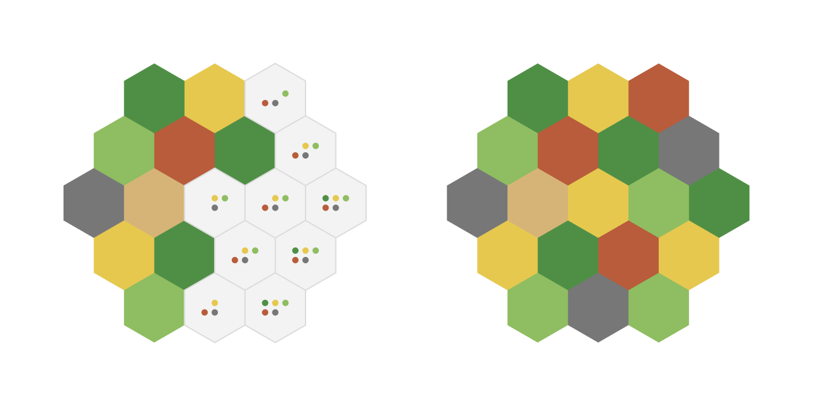

# Catan Board Generator

Wave function collapse board generator for Catan using custom rules.

- Weighted resource placement that fills the most constrained tiles first
- Placement rule sets that keep matching resources from clumping
- SVG rendering of the generated board
- Work in progress...
